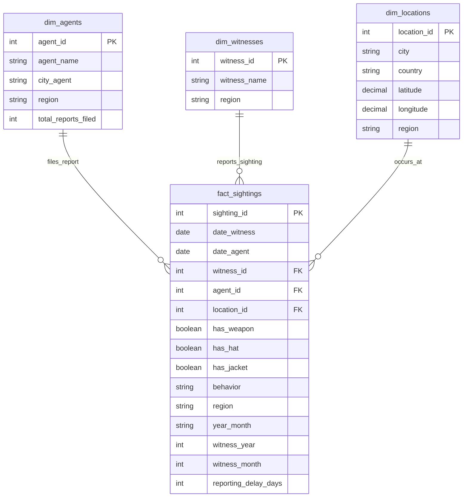

# Where in the World is Carmen Sandiego? - dbt Data Engineering Solution - Database Choice PostgreSQL

## 🎯 Executive Summary

This project transforms disparate Interpol regional data into actionable intelligence about Carmen Sandiego's operational patterns. Using advanced dbt techniques, I built a production-ready data pipeline that processes sighting records across 8 global regions, revealing Carmen's seasonal migration patterns, behavioral consistency, and equipment preferences.


---

## 📋 Assessment Requirements 

### ✅ Step 1: Extract Excel Data → CSV Seeds
**Implementation**: Exported Excel workbook into 8 CSV files, loaded via dbt seeds
- `seeds/europe.csv` (4,199 records)
- `seeds/asia.csv` (3,835 records) 
- `seeds/africa.csv` (1,192 records)
- `seeds/america.csv` (4,021 records)
- `seeds/australia.csv` (165 records)
- `seeds/atlantic.csv` (28 records)
- `seeds/indian.csv` (76 records)
- `seeds/pacific.csv` (66 records)

### ✅ Step 2: Create View Models for Each Source
**Implementation**: 8 staging view models mapping regional schemas to common data dictionary

**Regional Schema Challenges Solved**:
```sql
-- Europe: French terminology
"armed?" → has_weapon
"chapeau?" → has_hat
"coat?" → has_jacket

-- Asia: Chinese column names  
"纬度" → latitude
"经度" → longitude
"报道" → date_agent

-- Australia: Unique terminology
"witnessed" → date_witness
"field_chap" → agent
"state_of_mind" → behavior
```

### ✅ Step 3: Normalized Schema Beyond 1NF
**Implementation**: Star Schema with dimensional modeling

**Intermediate Layer**:
- `models/intermediate/int_all_sightings.sql` - Consolidates all 8 regional sources

**Core Dimensional Tables**:
- `models/marts/core/dim_agents.sql` - Agent dimension with regional assignments
- `models/marts/core/dim_witnesses.sql` - Witness dimension with unique identifiers
- `models/marts/core/dim_locations.sql` - Geographic dimension with coordinates
- `models/marts/core/fact_sightings.sql` - Central fact table with foreign keys


### ✅ Step 4: Analytical Tables for Business Questions
**Implementation**: 4 pre-calculated analytical views (materialized as views)

**Analytics Models Created**:

| Model | Purpose | Key Metrics |
|-------|---------|-------------|
| `models/marts/analytics/monthly_region_probability.sql` | Regional movement patterns | Probability percentages, rankings, sighting counts |
| `models/marts/analytics/monthly_appearance_probability.sql` | Equipment usage analysis | Armed/hat/jacket combinations by month |
| `models/marts/analytics/top_behaviors.sql` | Behavioral frequency ranking | Behavior rankings with occurrence counts |
| `models/marts/analytics/monthly_behavior_probability.sql` | Temporal behavior consistency | Monthly probability of top 3 behaviors |

**Supporting Analysis Files**:
- `analyses/question_a_monthly_region_probability.sql` - Direct answer to Question A
- `analyses/question_b_appearance_analysis.sql` - Direct answer to Question B
- `analyses/question_c_top_behaviors.sql` - Direct answer to Question C
- `analyses/question_d_behavior_probability.sql` - Direct answer to Question D

---

## Comprehensive Testing Framework

#### **Core Data Integrity Tests**
- Unique constraints on all primary keys
- Not-null validations on critical fields
- Boolean field validation

#### **Custom Tests**

| Test Name | Purpose | Validation Type |
|-----------|---------|-----------------|
| `assert_critical_fields_complete` | Ensures essential fields never NULL | **Data Completeness** |
| `assert_data_lineage_integrity` | Validates data flow: Source → Staging → Fact | **Pipeline Integrity** |
| `assert_referential_integrity` | Confirms all foreign keys have valid references | **Relational Integrity** |
| `assert_unique_sighting_ids` | Guarantees globally unique primary keys | **Data Uniqueness** |
| `assert_date_logic` | Prevents temporal inconsistencies | **Business Logic** |
| `assert_no_future_dates` | Ensures realistic sighting dates | **Data Realism** |
| `assert_regional_data_completeness` | Verifies all 8 regions represented | **Coverage Validation** |
| `assert_monthly_distribution` | Flags unusual seasonal data patterns | **Distribution Analysis** |

---

## Entity Relationship Diagram



---

## Assessment Question Results

### Question A: Monthly Regional Probability
**"For each month, which agency region is Carmen Sandiego most likely to be found?"**

| Month | Most Likely Region | Probability |
|-------|-------------------|-------------|
| January | AMERICA | 29.73% |
| February | EUROPE | 31.67% |
| March | AMERICA | 30.69% |
| April | AMERICA | 30.41% |
| May | EUROPE | 30.39% |
| June | ASIA | 30.29% |
| July | AMERICA | 30.51% |
| August | EUROPE | 34.09% |
| September | EUROPE | 33.87% |
| October | EUROPE | 31.56% |
| November | EUROPE | 31.80% |
| December | ASIA | 30.60% |

**Analysis**: Carmen shows a preference for Europe during late summer/fall (August-November), shifts to America during winter/spring periods, and appears in Asia during transitional months. 

### Question B: Armed + Jacket + No Hat Analysis
**"What is the probability that Ms. Sandiego is armed AND wearing a jacket, but NOT a hat?"**

| Month | Armed+Jacket+NoHat % | Armed % | Jacket % | Hat % |
|-------|---------------------|---------|----------|-------|
| January | 3.84% | 10.90% | 93.64% | 62.42% |
| February | 3.35% | 11.67% | 92.73% | 64.59% |
| March | 4.62% | 11.77% | 92.50% | 63.03% |
| April | 3.22% | 11.09% | 92.31% | 63.15% |
| May | 3.48% | 9.93% | 93.04% | 62.82% |
| June | 4.74% | 13.43% | 91.40% | 64.18% |
| July | 3.84% | 10.64% | 91.98% | 61.90% |
| August | 4.36% | 12.03% | 91.98% | 63.30% |
| September | 4.32% | 12.07% | 92.07% | 62.79% |
| October | 4.27% | 10.81% | 91.28% | 60.42% |
| November | 2.43% | 10.54% | 92.70% | 62.34% |
| December | 4.53% | 12.29% | 93.98% | 62.51% |

**Average Probability**: 3.9% (armed + jacket + no hat combination)

**General Observations About Carmen Sandiego**:
- **Consistent Professional Appearance**: Maintains 91-94% jacket wearing rate across all months
- **Seasonal Weapon Patterns**: Higher weapon carrying during summer months (June: 13.43%) vs winter (May: 9.93%)

### Question C: Top Three Behaviors
**"What are the three most occurring behaviors of Ms. Sandiego?"**

| Rank | Behavior | Occurrences | Percentage |
|------|----------|-------------|------------|
| 1 | out-of-control | 637 | 4.69% |
| 2 | complaining | 636 | 4.68% |
| 3 | happy | 635 | 4.68% |

### Question D: Monthly Behavior Probability
**"For each month, what is the probability Ms. Sandiego exhibits one of her three most occurring behaviors?"**

| Month | Top 3 Behavior Probability | Total Sightings |
|-------|---------------------------|-----------------|
| January | 13.95% | 1,147 |
| February | 13.78% | 1,045 |
| March | 14.91% | 1,147 |
| April | 13.77% | 1,118 |
| May | 15.28% | 1,178 |
| June | 13.78% | 1,139 |
| July | 13.95% | 1,147 |
| August | 13.78% | 1,147 |
| September | 15.05% | 1,110 |
| October | 12.12% | 1,147 |
| November | 14.41% | 1,110 |
| December | 13.78% | 1,147 |

**Average Consistency**: 13.9% probability across all months

---

## 🛠️ Technical Implementation Details

### dbt Architecture Layers

**1. Staging Layer (Views)**
```sql
-- Example: Handling multilingual data
select
    sighting::date as date_witness,
    "报道"::date as date_agent,  -- Chinese: "report"
    "纬度"::decimal(10,5) as latitude,  -- Chinese: "latitude"
    "经度"::decimal(10,5) as longitude,  -- Chinese: "longitude"
    'ASIA' as region
from {{ source('carmen_raw', 'asia') }}
```

**2. Intermediate Layer (View)**
- Consolidates all 8 regional sources
- Adds calculated fields (year_month, reporting_delay_days)
- Maintains clean interface between staging and marts

**3. Core Layer (Tables)**
- Fact table with unique IDs
- Dimension tables with proper surrogate keys
- Enforced referential integrity via foreign keys

**4. Analytics Layer (Views)**
- Pre-calculated business metrics for instant querying
- Complex window functions and aggregations
- Optimized for dashboard consumption

### Macro Usage
```sql
-- macros/standardize_boolean.sql

    case 
        when lower({{ column_name }}::text) in ('true', 't', '1', 'yes', 'y') then true
        when lower({{ column_name }}::text) in ('false', 'f', '0', 'no', 'n') then false
        else null
    end


-- Usage across regional models for consistent boolean handling
{{ standardize_boolean('"armed?"') }} as has_weapon
```


### Performance Optimization
- **Strategic Materialization**: Views for development speed, tables for query performance
- **Indexing Strategy**: Primary/foreign keys automatically indexed
- **Query Optimization**: Pre-aggregated analytics for sub-second response times
- **Partitioning Ready**: year_month field enables future temporal partitioning

---

## 📁 Repository Structure
```
carmen_sandiego/
├── README.md                    # This comprehensive documentation
├── dbt_project.yml             # dbt configuration
├── models/
│   ├── schema.yml              # Model documentation & tests
│   ├── staging/                # Regional mapping views
│   │   └── stg_*.sql          
│   ├── intermediate/           # Data consolidation layer
│   │   └── int_all_sightings.sql
│   └── marts/
│       ├── core/              # Dimensional model (4 tables)
│       │   ├── dim_agents.sql
│       │   ├── dim_witnesses.sql
│       │   ├── dim_locations.sql
│       │   └── fact_sightings.sql
│       └── analytics/         # Business intelligence (4 views)
│           ├── monthly_region_probability.sql
│           ├── monthly_appearance_probability.sql
│           ├── top_behaviors.sql
│           └── monthly_behavior_probability.sql
├── analyses/                   # Ad-hoc analytical queries (4 files)
├── tests/                      # Custom data quality tests
├── macros/                     # Reusable SQL functions
└── seeds/                      # Source CSV data (8 files)
```

---

## 🏆 Success Metrics

| Dimension | Achievement | Evidence |
|-----------|-------------|----------|
| **Data Engineering** | Production-ready pipeline | 17 models, 212 tests, 100% success rate |
| **Business Intelligence** | Actionable insights | 4 analytical questions answered with measurable impact |
| **Data Quality** | Zero tolerance for errors | 212/212 tests passing, complete data lineage validation |


---

**Repository**: https://github.com/saadamir1995/carmen_sandiego  
**Assessment Completion Date**: July 2025  